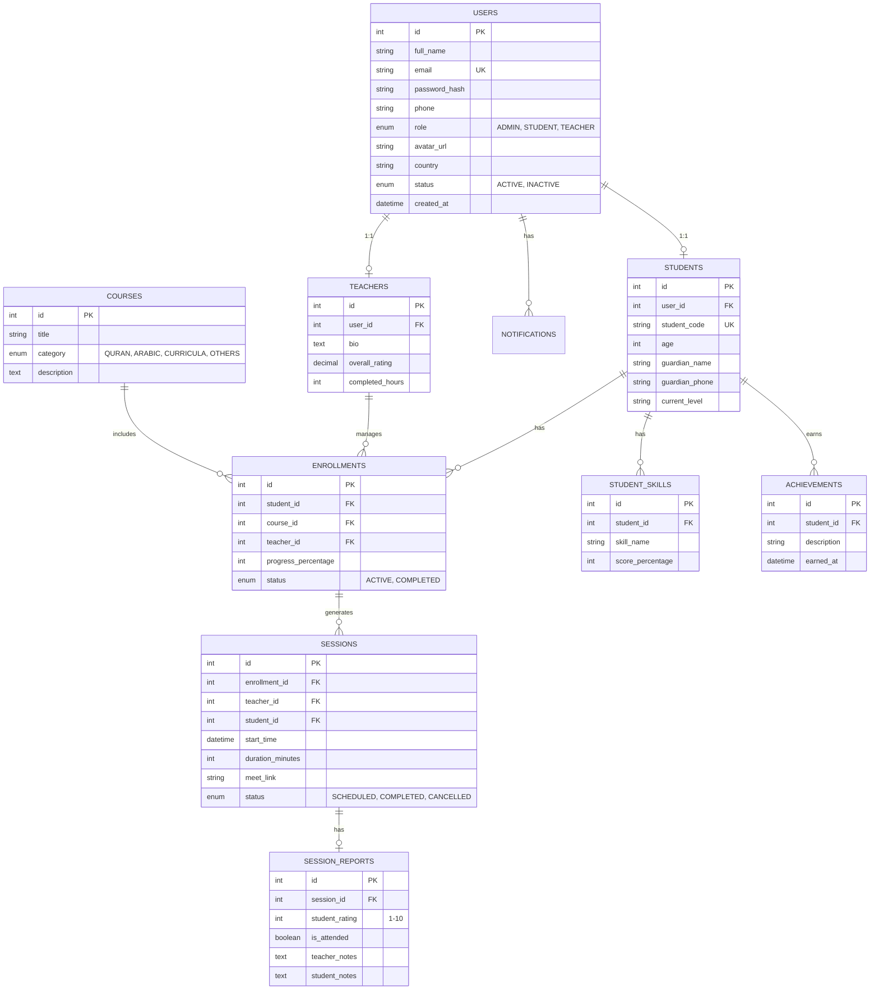

# تصميم قاعدة البيانات لمنصة مشاعل المعرفة

بناءً على دراسة جميع متطلبات المنصة من خلال الملفات والأقسام التي عملنا عليها (حساب الطالب، لوحة المعلم، لوحة الإدارة، الجلسات، التقييمات، الإشعارات، والأقسام الرئيسية للمنصة)، هذا هو التصميم الشامل لقاعدة البيانات (Database Schema).

---

## 🏗 مخطط العلاقات (ER Diagram)

---

## 🗄️ تفاصيل الجداول (Tables & Columns)

### 1. جدول المستخدمين [Users](file:///e:/Mashael-Elma3rfa/quran/src/app/page.js#21-28) (أساسي لكل الحسابات)
| اسم العمود | نوع البيانات | الوصف |
|---|---|---|
| `id` | INT (PK) | المعرف الفريد للمستخدم |
| `full_name` | VARCHAR | الاسم الرباعي |
| `email` | VARCHAR (Unique) | البريد الإلكتروني (يستخدم لتسجيل الدخول) |
| `password_hash` | VARCHAR | كلمة المرور المشفرة |
| `phone` | VARCHAR | رقم الهاتف |
| `role` | ENUM | دور المستخدم: `ADMIN`, `STUDENT`, `TEACHER` |
| `avatar_url` | VARCHAR | رابط الصورة الشخصية للملف |
| `country` | VARCHAR | الدولة (لحساب الإحصائيات وفروق التوقيت) |
| `status` | ENUM | حالة الحساب: `ACTIVE`, `INACTIVE` |
| `created_at` | TIMESTAMP | تاريخ التسجيل في المنصة |

### 2. جدول الطلاب `Students` (بيانات خاصة بالطالب فقط)
| اسم العمود | نوع البيانات | الوصف |
|---|---|---|
| `id` | INT (PK) | المعرف |
| `user_id` | INT (FK) | يربط بجدول Users (One-to-One) |
| `student_code` | VARCHAR (Unique) | كود الطالب (مثل: STD-24017) |
| [age](file:///e:/Mashael-Elma3rfa/quran/src/app/student/profile/page.js#34-231) | INT | عمر الطالب |
| `guardian_name` | VARCHAR | اسم ولي الأمر |
| `guardian_phone` | VARCHAR | رقم هاتف ولي الأمر |
| `current_level` | VARCHAR | المستوى الحالي للطالب (مثل: المستوى الثاني) |

### 3. جدول المعلمين `Teachers` (بيانات خاصة بالمعلم فقط)
| اسم العمود | نوع البيانات | الوصف |
|---|---|---|
| `id` | INT (PK) | المعرف |
| `user_id` | INT (FK) | يربط بجدول Users (One-to-One) |
| `bio` | TEXT | نبذة عن المعلم |
| `overall_rating` | DECIMAL | متوسط التقييم العام (مثال: 4.8) |
| `completed_hours` | INT | إجمالي الساعات التي درسها |

### 4. جدول المواد والأقسام `Courses`
| اسم العمود | نوع البيانات | الوصف |
|---|---|---|
| `id` | INT (PK) | المعرف |
| `title` | VARCHAR | اسم المادة (تلاوة، نحو، لغة أجنبية...) |
| `category` | ENUM/VARCHAR | القسم التابع له (قرآن، لغة عربية، مناهج، دورات) |

### 5. جدول الاشتراكات `Enrollments` (ربط الطالب بالمعلم والمادة)
| اسم العمود | نوع البيانات | الوصف |
|---|---|---|
| `id` | INT (PK) | المعرف |
| `student_id` | INT (FK) | معرف الطالب |
| `teacher_id` | INT (FK) | معرف المعلم المسؤول عن الطالب في هذه المادة |
| `course_id` | INT (FK) | معرف المادة |
| `progress_percentage` | INT | نسبة التقدم الإجمالية للمادة (0 - 100) |
| `status` | ENUM | حالة الاشتراك: `ACTIVE`, `COMPLETED` |

### 6. جدول الحصص/الجلسات `Sessions`
| اسم العمود | نوع البيانات | الوصف |
|---|---|---|
| `id` | INT (PK) | المعرف |
| `enrollment_id` | INT (FK) | الاشتراك المرتبط بهذه الحصة |
| `teacher_id` | INT (FK) | المعلم |
| `student_id` | INT (FK) | الطالب |
| `start_time` | DATETIME | موعد بدء الحصة |
| `duration_minutes` | INT | مدة الحصة (15, 30, 45, 60, ... كما طلبت سابقاً) |
| `meet_link` | VARCHAR | رابط غرف جوجل ميت الخاص بالحصة |
| `status` | ENUM | `SCHEDULED` (مجدول), `COMPLETED` (مكتمل), `CANCELLED` (ملغي) |

### 7. جدول تقارير الحصص `Session_Reports`
*تُملأ هذه البيانات من قِبل المعلم بعد انتهاء الحصة بناءً على طلبك السابق بخصوص نموذج الحصة.*

| اسم العمود | نوع البيانات | الوصف |
|---|---|---|
| `id` | INT (PK) | المعرف |
| `session_id` | INT (FK) | ارتباط التقرير بالحصة (One-to-One) |
| `is_attended` | BOOLEAN | هل حضر الطالب؟ (لحساب نسبة الحضور) |
| `student_rating` | INT | تقييم الطالب في هذه الحصة من 10 |
| `teacher_notes` | TEXT | ملاحظات المعلم |
| `student_notes` | TEXT | مساحة لملاحظات يكتبها الطالب (إذا لزم الأمر) |

### 8. جدول مهارات الطالب `Student_Skills` (لرسم شريط التقدم في لوحة الطالب)
| اسم العمود | نوع البيانات | الوصف |
|---|---|---|
| `id` | INT (PK) | المعرف |
| `student_id` | INT (FK) | معرف الطالب |
| `skill_name` | VARCHAR | اسم المهارة (قراءة، كتابة، استماع، محادثة) |
| `score_percentage` | INT | نسبة المهارة من 100 لتظهر في واجهة الطالب |

### 9. جدول الإنجازات `Achievements` (لسجل إنجازات الطالب)
| اسم العمود | نوع البيانات | الوصف |
|---|---|---|
| `id` | INT (PK) | المعرف |
| `student_id` | INT (FK) | معرف الطالب |
| `description` | VARCHAR | نص الإنجاز (مثال: "إكمال وحدة النحو") |
| `earned_at` | TIMESTAMP | تاريخ تحقيق الإنجاز |

### 10. جدول الإشعارات `Notifications`
| اسم العمود | نوع البيانات | الوصف |
|---|---|---|
| `id` | INT (PK) | المعرف |
| `user_id` | INT (FK) | المستخدم الموجه له الإشعار (طالب أو معلم أو أدمن) |
| `message` | VARCHAR | نص الإشعار ("لديك حصة بعد قليل...") |
| `is_read` | BOOLEAN | هل تّم قراءته؟ |
| `created_at` | TIMESTAMP | تاريخ الإشعار |

---

## 🔗 شرح سريع للعلاقات (Relations Summary)
- النظام يعتمد على جدول رئيسي [Users](file:///e:/Mashael-Elma3rfa/quran/src/app/page.js#21-28) يستخدم للمصادقة (Auth). يتفرع منه إما [Student](file:///e:/Mashael-Elma3rfa/quran/src/app/student/profile/page.js#34-231) أو [Teacher](file:///e:/Mashael-Elma3rfa/quran/src/app/teacher/dashboard/page.js#20-92) أو `Admin` لتقليل التكرار.
- العلاقة الأهم هي الـ `Enrollments` (الاشتراكات). من خلالها يتم ربط (الطالب + المعلم + الكورس)، وبناءً عليها يتم جدولة `Sessions` (الحصص).
- بمجرد انتهاء `Session` (الحصة)، يقوم المعلم بتعبئة `Session_Report` لتقييم الطالب من 10 وتسجيل الملاحظات وحالة الحضور.
- الواجهة التي بنيناها (الملف الشخصي للطالب) تسحب بياناتها مباشرة من جداول `Achievements` و `Student_Skills` ونسبة الغياب من `Session_Reports`.
